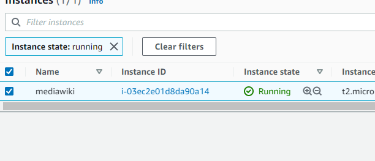
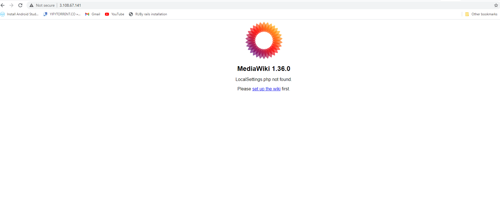

# Installing Mediawiki using Terraform and AWS

Mediawiki runs on LAMP stack

[Mediawiki Documentation] https://www.mediawiki.org/wiki/Manual:Running_MediaWiki_on_Red_Hat_Linux

## Steps to confugire and deploy mediawiki on a RHEL8:

**1.  Make sure you have a configured terraform and aws-cli setup.**

[AWS Configure Reference] https://docs.aws.amazon.com/cli/latest/userguide/cli-configure-files.html

[Terraform cli setup] https://learn.hashicorp.com/tutorials/terraform/install-cli

**2. Set tfvars for mediawiki depoyment**

```
vars/mediawiki.tfvars
---------------------
mediawiki_version = "1.36.0"
instancetype = "" # ec2 instance type
db_root_pass = "" # mysql root password
db_wiki_pass = "" # mysql wiki user password
```
**3. Initialize terraform workspace**
```
cd app/mediawiki

$ terraform init
Initializing modules...
Initializing the backend...
Initializing provider plugins...
Terraform has been successfully initialized!
```
**4. Terraform plan to validate config**

```
cd app/mediawiki/
terraform plan --var-file="../../vars/mediawiki.tfvars"
```
**5. Terraform apply to deploy mediawiki on an RHEL8 instance**

```
cd app/mediawiki
terraform apply --var-file="../../vars/mediawiki.tfvars"
```
Once you do terraform apply, within few minutes the instance will gets created on the specified region and specified mediawiki version will gets installed.



You can access your application on port 80 as below.




## Scaling Mediawiki ##

The current setup is not scalable as it has depedency on Maria DB.
To make it scalable we need to make few changes to the existing setup.

1.  Create ASG with launc template/configuration whhich holds the instance information.

2. Instead of having a mariaDB installed on a ec2 machine we can leverage RDS mariaDB as our central application DB.

3. Once we switch to ASG, we can leverage rollingupdate deployment model as well and which enables us to have zero downtime deployments.
